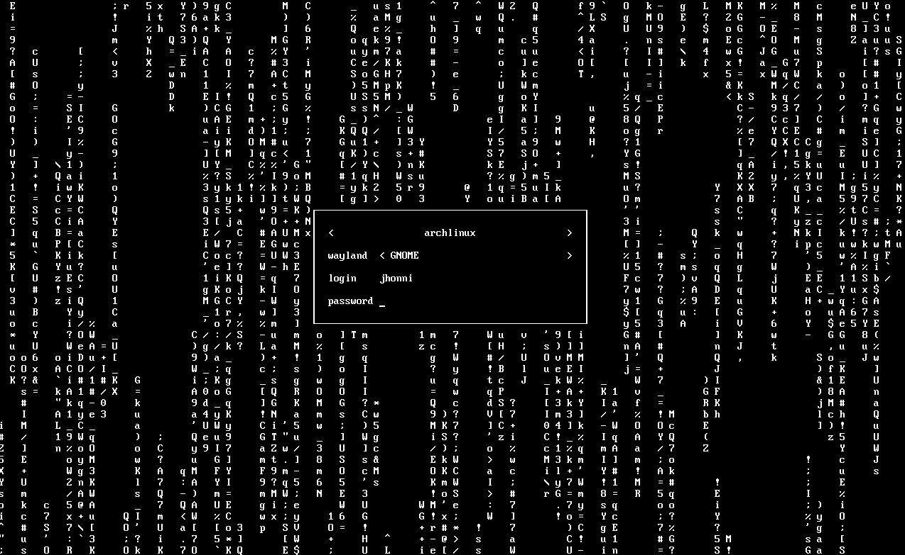
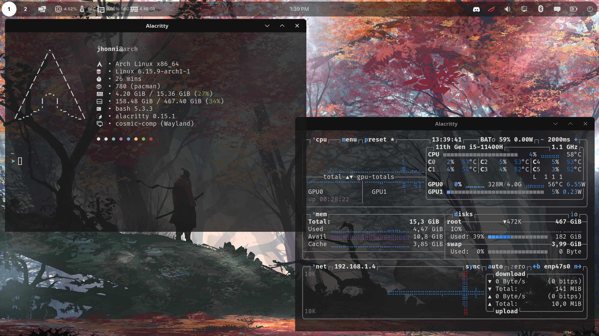
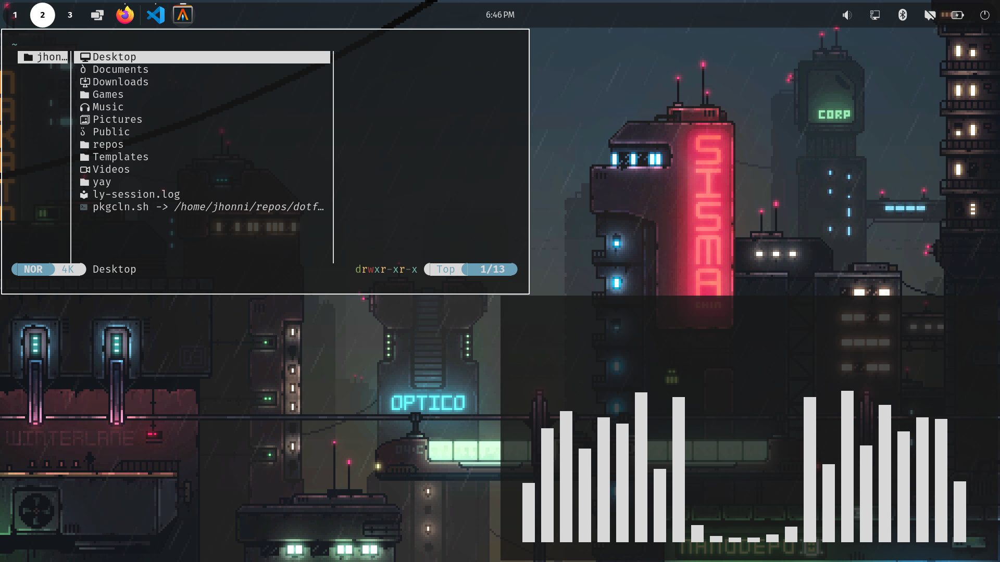

# Dotfiles

my personal dotfiles for arch.

---

##  Screenshots

  
  

---

## Dependencies

- `ly`
- `alacritty`
- `fastfetch`
- `btop` 
- `cava`
- `yazy`
- `ttf-fira-sans`
- `ttf-fira-code`
- `ttf-firacode-nerd`

---

## Installation

### First clone the repo
```bash
git clone https://github.com/yourusername/dotfiles.git
cd dotfiles
```

### Copy the dotfiles to your config directory
```bash
cp -r dotfiles/.config/* ~/.config/
```

### Copy the LY configuration
```bash
cd  /etc/ly/config.ini
```

### Enable LY as your display manager 
```bash
systemctl disable DISPLAY_MANAGER
systemctl enable ly.service
```

