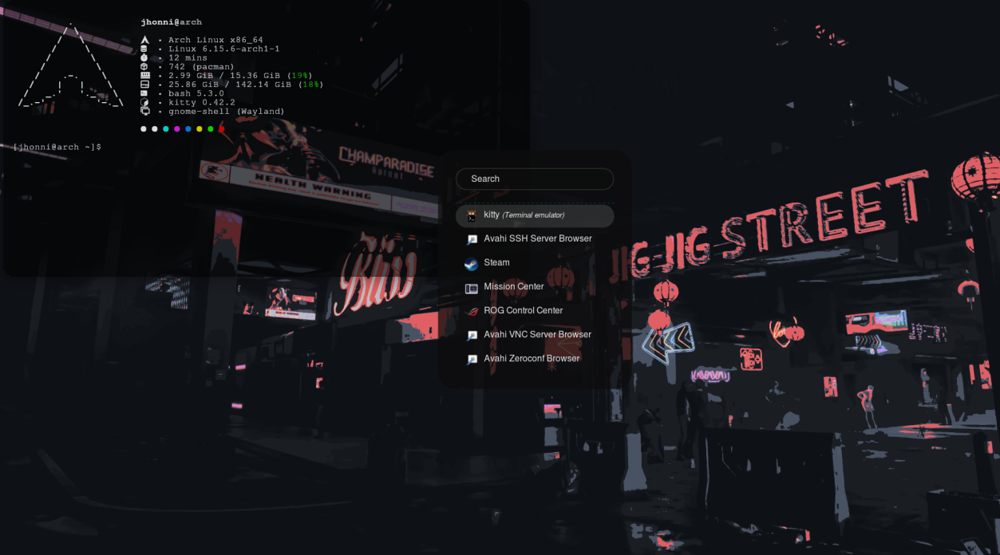
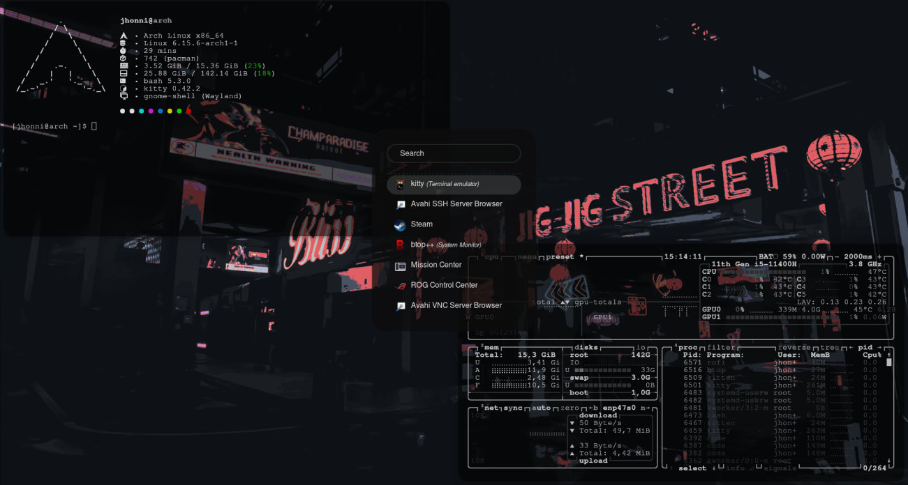
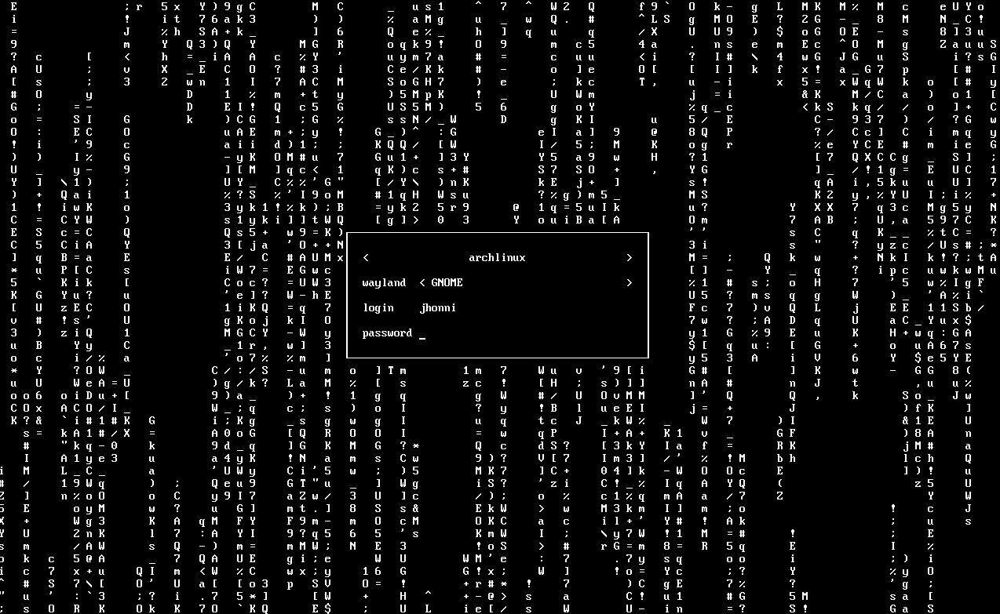

# Dotfiles

These are my personal dotfiles for Arch Linux, heavily inspired by [ml4w dotfiles](https://github.com/mylinuxforwork/dotfiles).  
They should work in most desktop environments, although some tweaks might be necessary depending on your setup.

---

##  Screenshots

  
 

---

## Dependencies

- `kiity`
- `fastfetch`
- `rofi`
- `ly`

You can install them using:

```bash
sudo pacman -S kitty fastfetch rofi ly
```

---

## Installation

### First clone the repo
```bash
git clone https://github.com/yourusername/dotfiles.git
cd dotfiles
```

### Copy the dotfiles to your config directory
```bash
cp -r ./config/* ~/.config/
```

### Copy the LY configuration
```bash
cd  /etc/ly/config.ini
```

### Enable LY as your display manager 
```bash
systemctl disable DISPLAY_MANAGER
systemctl enable ly.service
```

